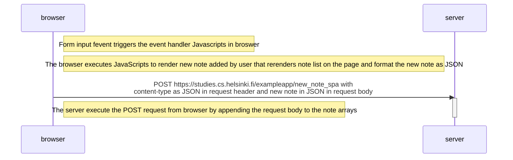

```mermaid
sequenceDiagram
    participant browser
    participant server

    Note right of browser: Form input fevent triggers the event handler Javascripts in broswer
    Note right of browser: The browser executes JavaScripts to render new note added by user that rerenders note list on the page and format the new note as JSON
    browser->>server:  POST https://studies.cs.helsinki.fi/exampleapp/new_note_spa with <br/>content-type as JSON in request header and new note in JSON in request body 
    activate server

    Note right of browser: The server execute the POST request from browser by appending the request body to the note arrays
    deactivate server

```